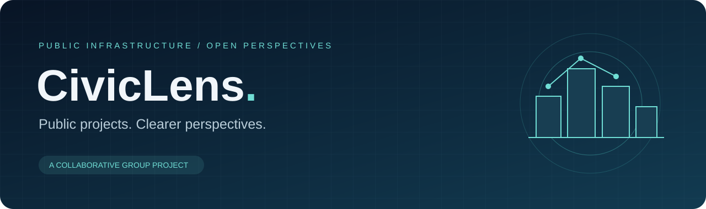

<p align="center">
  
</p>

<p align="center">
  <strong>A shared lens on public infrastructure.</strong><br />
  Explore projects, understand budgets, and follow progress in one place.
</p>

<p align="center">
  
  
  
  
</p>

<p align="center">
  <a href="https://workspace-sandy-beta.vercel.app/">Live website</a> ·
  <a href="#explore-civiclens">Explore</a> ·
  <a href="#run-locally">Run locally</a> ·
  <a href="#live-website">Deployment</a> ·
  <a href="#team">Team</a>
</p>

## Why CivicLens?

Public infrastructure information can be difficult to navigate. CivicLens is a collaborative prototype that brings project status, spending, departments, and timelines into an approachable interface.

## Explore CivicLens

| Experience | What you can explore |
| --- | --- |
| Project explorer | Search sample projects and filter by status |
| Project details | Review budgets, progress, and illustrative milestones |
| Dashboard | Explore charts for sample project status and departments |
| Search | Find sample projects and departments |
| News | Browse illustrative infrastructure updates |
| Assistant | Try a conversational interface with simulated responses |

**Current stage: demonstration prototype.** Project and news data are examples. Login and signup simulate navigation and do not authenticate users. Assistant responses are scripted. Documents and maps are placeholders. The frontend does not currently call the included FastAPI backend.

## Run locally

Requires Node.js 22+ and npm. From the repository root:

```bash
cd CivicLens/civic-lens
npm ci
npm run dev
```

Open <http://localhost:3000>. For this downloaded workspace, the app folder is simply `civic-lens`.

```bash
npm run build       # Build the Next.js frontend
npm run typecheck   # Check TypeScript
npm run lint        # Run ESLint
```

Optional backend, from `CivicLens/backend`:

```bash
python -m venv .venv
# Activate the virtual environment for your operating system.
pip install -r requirements.txt
uvicorn main:app --reload
```

API documentation: <http://localhost:8000/docs>.

## Project structure

```text
docs/assets/                Repository artwork
CivicLens/
  civic-lens/               Next.js frontend
    src/app/                Pages and interfaces
    src/lib/                Demo project data and Firebase setup
    public/                 Static assets
  backend/                  FastAPI sample API
```

## Live website

[Open CivicLens on Vercel →](https://workspace-sandy-beta.vercel.app/)

The project already has a Vercel deployment. This repository uses the standard Next.js build configuration and does not deploy to GitHub Pages.

## Next steps

- Connect the frontend to real project data and the API.
- Implement authentication and a model-backed assistant.
- Add accessible maps and available project documents.
- Add meaningful integration tests as services are connected.

## Team

CivicLens is a **group project**, maintained collaboratively in [preethamreddy2007/Civiclens](https://github.com/preethamreddy2007/Civiclens). Chaithan Reddy is part of the project team. Individual contributions are recorded in the repository history.

Questions and improvements are welcome through [issues](https://github.com/preethamreddy2007/Civiclens/issues) and pull requests. No open-source license has been declared; ask the team before reusing or redistributing the code.
